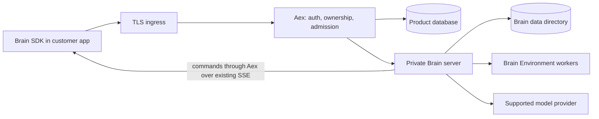

# ADR-002: Start with an explicit HTTP boundary to an unchanged Brain server

Status: Proposed. Date: 2026-09-06. Depends on ADR-001 and the M0 integration experiment.

## Context

Brain already ships HTTP/SSE, a TypeScript client, host registration, artifact admission,
credential custody and durable request claims. Its `BrainApi` does not take a customer
principal; its default bearer protects a deployment, not an account. Reuse requires a
product boundary, not direct exposure of that bearer to customers.

## Decision

Run one Rust/Axum Aex gateway and one private Brain server on the serving node, plus Brain's
own worker processes. Use Brain's existing HTTP contract and `brain-protocol` Rust types
from a matching immutable revision. Brain storage is mounted only into Brain; Aex uses API
operations rather than reading journal files to implement customer requests.

The extra HTTP hop is a deliberate isolation and maintenance trade-off. Keep pooled
connections, stream bytes without buffering the whole response, and measure overhead.
There is no gateway call on each model token to a product database and no second event bus.

Use the existing Brain SDK with an Aex URL and account key. Preserve supported Brain schemas,
status codes, committed sequence cursors, host tokens and lifecycle semantics. Aex defines
only its new account/key/operator contracts. Generate those from implementing Rust types
and route annotations; do not copy Brain's OpenAPI or SDK implementation into Aex.

The gateway uses an explicit supported method/path set. Unknown Brain routes are not
automatically public after an upgrade. Session-scoped routes require account ownership;
session lists originate from Aex-owned IDs rather than an unfiltered Brain-wide list.
Host-token routes use their own authentication and account-status check, not an account
bearer substituted into every request. Deployment credentials never appear downstream.

Curated Component admission must remain compatible with the SDK's automatic upload path:
accept bounded bytes, compare their content identity to the release's admitted set, and
delegate only approved content. Do not disable upload and then publish a quickstart that
still relies on it. Disallowed content fails before compilation.

MVP denies customer-selected remote Environment URLs and does not expose remote execution
callback routes. `hostEnv` uses Brain's existing SSE command/result transport; there is no
WebSocket gateway or separate host protocol to build.

## Integration limitation to resolve in M0

Brain currently chooses the session ID internally. Its create response and Aex's ownership
row cannot commit atomically across HTTP. Host registration also lacks the same durable
request/replay mechanism as session create. Aex must implement the bounded failure behavior
in ADR-003; a successful response without durable ownership is prohibited.

The default proposal tolerates inaccessible orphan resources and an explicit ambiguous
operation requiring operator cleanup. If the owner requires transparent recovery of every
accepted create, M0 must prove a neutral create-ID/operation-result seam upstream, or choose
composition through Brain's public session services. That requirement cannot be hidden in a
“thin proxy” estimate. Do not implement both architectures.

## Alternatives and consequences

Embedding Brain libraries removes a network hop and permits explicit session IDs through
`brain-sessions`, but then Aex must compose server resources, credential wiring and routes.
That is feasible, not free. Prefer it only if M0 proves the existing facade insufficient
or its measured overhead exceeds the launch budget. Never copy the server's composition
internals merely to avoid writing down this trade-off.

An authenticated catch-all reverse proxy is smaller but does not establish resource
authorization, host ownership, account-scoped keys or create consistency.

## Acceptance evidence

The same published Brain client performs the entire hosted journey, including automatic
artifact admission, host reconnect and committed-event replay. Two accounts using the
same operation key remain independent. Fault injection covers both sides of the create
boundary. Direct-versus-gateway latency and stream memory are measured on identical hardware.

Brain references: [HTTP service interface](https://github.com/aexhq/brain/blob/0ca8e99d7790b6e8a5b0dcde38d7dfe77c27b247/crates/brain-http/src/service.rs),
[server operations](https://github.com/aexhq/brain/blob/0ca8e99d7790b6e8a5b0dcde38d7dfe77c27b247/crates/brain-server/src/service.rs).
This inspected source baseline is not yet a selected Aex release dependency.
